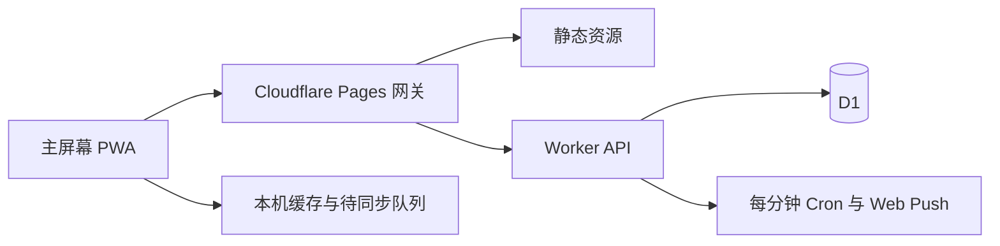

# NEU Schedule PWA 项目经验报告：v23

本报告记录 [v23 功能基线](BASELINE_V23.md) 的实际实现，供后续个人 PWA 和时间安排类项目参考。它描述代码里已存在的机制及其边界；课程内容、个人训练记录和密钥不属于可复制的模块素材。

## 1. 架构与数据权威

| 数据 | 运行时权威 | 本机角色 | 写入边界 |
| --- | --- | --- | --- |
| 课程、节次、健身房开放表 | D1 `schedule_data` | 登录后读取的缓存 | 受控迁移或后台操作；网页无写接口 |
| 训练记录 | D1 `gym_sessions` | 离线可修改并排队补传，可导出 JSON | 已登录的 `/state/commit` |
| 当天翘课 | D1 `daily_skips` | 当日缓存、断网操作队列 | 服务端只接受上海时区当天，旧记录清理 |
| 视图偏好 | D1 `app_settings` | 页面本机偏好 | 已登录的 `/state/commit` |
| 唯一通行密钥、会话 | D1 认证表 | 同域 HttpOnly Cookie | 认证状态机；后台恢复 SQL |
| 推送订阅、计划、投递状态 | D1 `devices`、`reminders` | 浏览器订阅及设备令牌 | 登录会话与设备令牌共同校验 |

经验：将**时间表事实**、**长期行为记录**和**短期意向状态**分开建模。“健身房开放”只是背景时段；只有用户按下开始/结束才产生训练记录。“翘课”只是当天对课程的选择，既不等于训练，也不应进入长期成就统计。

## 2. 课程模型与时间几何

**文件：** `app.js`、`styles.css`、`worker/migrations/0003_seed_schedule.sql`；约束验证在 `scripts/validate.mjs`、`scripts/validate-ui.mjs`。

- 学期起始周一、教学周数、课程星期、节次范围、上课周集合和每节起止时间共同决定课程是否出现。课程块时间来自首节开始和末节结束；块内再次标出所跨节次。
- 周表和日程共用 `DAY_START=0`、`DAY_END=1440`、`pct(minute)`。两张图的坐标容器使用同一个 `--timeline-height: 1440px`。节次块、课程块、健身背景、边界线和当前时间线都按真实分钟定位。两个端点标 `00:00`、`24:00`，中间可视空间留给课程节次起止与健身交叉时刻。
- 课程之间的课间也占据实际分钟距离。不能把“第几节”直接当等高网格，否则周表和日程会在课程上下边界产生错位。
- 健身开放层按**连续日日期序号**选择两种浅色，不能只用星期奇偶；否则周日到下周一会重复颜色。课程视觉层级高于背景；不对齐节次的健身边界才用辅助虚线和独立时间标签。
- 课程颜色从名称稳定计算，短名只用于窄列识别；详情保留完整名称、教师、地点、班级等信息。短名不是另一份课程数据。

可复用的是“唯一分钟坐标 + 统一容器高度 + 所有图层同源定位”的几何约束。节次时刻和课程名单属于本项目，其他学校必须重建并校验自己的数据。将周表与日程的**同一课程上下边界**作为视觉回归检查，而不只检查文本是否存在。

## 3. 日程、交互与当天状态

**文件：** `index.html`、`app.js`、`styles.css`；交互验证在 `scripts/validate-ui.mjs`。

- 周表完整展示七日；日程把所选日期展开为时钟、当前/将近事件、提醒、真实时间地图和进度线。日程从同一课程/开放数据推导，没有第二份手写日程。页面每分钟刷新，并在回到前台时重绘。
- 当前课程、30 分钟内课程准备、下课前提示、健身房可用与即将关闭等可以并存。空闲可健身窗口由开放段扣除**未翘**课程计算；这不是自动认定用户已到健身房。
- 只能翘今天实际存在的课；翘课后周表和日程的课程块留在原位并弱化，提醒文案改为“已翘课程”。支持单节恢复和一键撤销。跨日时前端过滤昨天的键，服务端拒绝旧日写入并由 Cron 清理旧日行。
- 周切换、日期选择、标签切换及“回到今天”都改变同一组选中周/日状态。顶部固定在 `100dvh` 和安全区内，三大内容区独立滚动，避免 Safari 浏览器栏变化带着整个页面移动。
- `viewModeTouched` 标记用户本次打开后主动切换过标签。迟到的云端偏好只能在用户尚未操作时初始化视图；否则会造成点按后瞬间回跳。

经验：异步初始化只适合填补**尚未被用户明确选择的状态**。视图、筛选、选中日期这类交互状态应在请求完成后判断用户是否已改动。时间事件状态最好由一个纯推导函数产生，页面与推送计划再各自消费。

## 4. 健身记录与统计

**文件：** `gym-store.js`、`app.js`、`cloud-sync.js`；验证在 `scripts/validate-gym.mjs`。

一次训练保存 `startAt`、`endAt`、`closesAt`、`endReason`，有效区间受当次开放时段约束。开始、结束、修改、删除、JSON 导入/导出与历史统计均围绕实际训练记录；跨打开页面可恢复进行中的训练，到闭馆可自动结束并标明原因，供用户核对。周/月摘要和趋势从记录计算，不存第二份汇总真值。

经验：历史行为必须基于真实起止时间。旧数据只有“某个开放段结束时间”时，不能倒推为一次真实训练。导出备份要是可读、可验证的结构；导入要验证不重叠和时间边界。健身统计与翘课状态保持各自生命周期。

## 5. 本机缓存与云同步

**文件：** `cloud-sync.js`、`gym-store.js`、`app.js`；验证在 `scripts/validate-cloud.mjs` 和 Worker 测试。

已登录设备先把旧版本机训练记录转成操作队列，再拉取服务器状态；本机修改经队列上传到 `/state/commit`。同步请求使用同源 Cookie 和 `cache: no-store`，没有在页面保存可读取的长期登录密钥。删除也作为独立操作发送，避免服务器下次刷新把记录“复活”。初次导入标记经历 `pending` 到 `yes`；初始化请求尚未结束时新增的设置操作仍需在后续轮次送达。

边界：这是个人使用的轻量操作队列，并非通用多用户冲突合并或强事务离线数据库。错误提示和待补传队列可帮助恢复网络故障；清理站点数据或更换域名会丢失本机尚未上传的操作。重要训练记录应定期导出 JSON。

经验：先定义权威和首次迁移顺序，再设计离线队列。测试应人为暂停首次同步，随后触发标签切换、删除或新增，检查迟到的响应不能覆盖更新的用户选择。

## 6. 单人通行密钥认证

**文件：** `worker/src/auth.js`、`worker/migrations/0004_single_passkey.sql`、`worker/admin/*.sql`、`auth-client.js`、`bootstrap.js`。完整状态机、接口和恢复步骤见 [认证设计](../worker/AUTH_DESIGN.md)。

- 只有一个凭据槽：空槽且窗口关闭时无法登记；后台单独打开五分钟窗口后，还需高熵初始化密钥才能登记；登记成功立即关窗；槽满后只接受该通行密钥登录。
- 初始化密钥不产生业务会话。WebAuthn 服务端验证挑战、来源、RP ID、签名和用户验证；成功后发同域 `__Host-neu_session` Cookie。数据库只保存会话令牌散列，最长有效期 90 天，打开页面先查状态，已有会话不用每次重新验证。
- 丢失设备和密钥时，后台 SQL 增加 epoch、清空凭据/会话/设备订阅并**保持窗口关闭**，之后再单独开窗。恢复入口不是公开网页按钮；重置不会自动放行任何访问者。
- `bootstrap.js` 只在认证并读取 `/schedule` 后启动业务页面。后端地址由同源页面推导，避免在本机持久化可手改的 API 地址。

经验：可迁移的是状态机、权限分层、后台恢复和验证边界；其他 PWA 要有自己的域名/RP ID、密钥槽、Secret、会话库和测试。一个 Apple ID 有助于在设备间同步通行密钥，但这个项目并没有把 Apple ID 当服务端身份标识，也不保证任何登录了该 Apple ID 的设备都能自动通过认证。

## 7. iPhone PWA 视口与控件

**文件：** `index.html`、`styles.css`、`bootstrap.js`。

2008 年前后 Web 2.0 的蓝灰工具栏、边框与表格式信息密度是产品视觉选择；它不改变数据和安全模块。外壳用 `100dvh`、`100svh` 与 safe-area 约束高度，内容区独立滚动。主屏幕模式拦截多点手势缩放；登录输入框用 16px 字号并允许登录卡自身滚动，处理 iPhone 聚焦时放大/偏移。训练趋势选择框仍使用其原有较小尺寸，不能把所有表单控件一律调成 16px。

经验：iOS 的“页面缩放”和“聚焦输入框自动放大”是两件事。只改 viewport 元信息不足以修复键盘触发的布局偏移。视觉回归应分别检查主屏幕 PWA、Safari 标签页、登录状态、窄屏与键盘弹出时的滚动和控件计算字号。系统辅助功能和浏览器自身行为不能靠网页保证完全禁用。

## 8. Web Push 与提醒计划

**文件：** `app.js`、`sw.js`、`worker/src/index.js`、`worker/migrations/0001_init.sql`；验证在 `scripts/validate-push.mjs`、`worker/test/worker.test.mjs`。

客户端从课程、翘课和可健身窗口生成带稳定 ID 的未来提醒计划，上传到 `/sync`。Worker 校验数量、时间、唯一 ID 和文本长度，按设备替换未发计划；计划散列未变化时直接返回。每分钟 Cron 领取到期提醒、限制重试次数、发送 Web Push、记录发送时间并清理过期任务。通知数据采用 Declarative Web Push 格式，Service Worker 也处理 `push` 与点击后打开日程；支持的设备会设置一个待查看角标。

开启订阅需登录会话。之后同步、测试或关闭还需该设备自己的令牌；服务端只保存令牌散列。iPhone 需将站点加入主屏幕并从主屏幕打开，且允许通知。更换域名、设备、订阅或 VAPID 密钥后可能需要重新开启。

经验：Web Push 是尽力送达机制，Cron 每分钟运行不等于设备端准点响铃，也不是 iOS 原生闹钟、实时活动或持久大卡片。固定提醒 ID 与服务端领取状态用于计划一致性和降低重复发送；**没有实现客户端五分钟成功接收窗口去重或批量竞速多推送**，后续项目不应从本报告误读为已有保证送达机制。测试通知只能证明当时该设备的订阅链路可用。

## 9. 部署、缓存与旧域名

**文件：** `worker/gateway/src/_worker.js`、`worker/gateway/build.mjs`、`worker/gateway/wrangler.jsonc`、`worker/wrangler.jsonc`、`sw.js`、`.github/workflows/pages.yml`；操作命令见 [Worker README](../worker/README.md)。

Pages 网关把认证/业务 API 请求转发到 Worker Service binding，静态资源交给 Pages；页面与 API 同域，让 WebAuthn RP ID、Cookie 与 PWA scope 同域成立。Worker 使用 D1 和 Cron。构建脚本把根目录静态资源及固定版本的 SimpleWebAuthn 浏览器库复制到网关 `dist/`。Service Worker 使用 `neu-schedule-v23` 缓存，导航优先联网，静态资源采用版本化 URL，认证和数据 API 不入缓存；注册时使用 `updateViaCache: 'none'`。

旧 GitHub Pages 工作流仍运行前端校验，但只发布 404 页面，避免旧域名继续作为可用入口。域名迁移不会迁移旧源的 Cookie、localStorage 或 PushSubscription；重新加入主屏幕、登录、导入旧训练备份与重开推送是迁移步骤。

经验：发布顺序是备份 D1、检查/执行迁移、验证 Worker、构建并部署 Pages、检查同域 API 和资源版本、最后做设备操作回归。初次部署才需要登记窗口；**日常发布不能重开登记窗口或重置现有通行密钥**。不要把静态资产更新、数据库迁移和用户状态重置混为一个动作。

## 10. 验证矩阵与已知边界

| 风险 | 自动验证 | 仍需人工验证 |
| --- | --- | --- |
| 课程/开放表与周日坐标 | `scripts/validate.mjs`、`validate-ui.mjs` | iPhone 周/日同一课程上下边界的视觉对齐 |
| 训练数据和云同步竞态 | `validate-gym.mjs`、`validate-cloud.mjs`、Worker tests | 真实断网、重连与跨设备记录核对 |
| 登录边界 | `validate-login.mjs`、本地 WebAuthn 集成测试、`verify-live-auth.mjs` | 真机聚焦键盘、Face ID/通行密钥弹层 |
| 提醒计划及 Worker | `validate-push.mjs`、Worker tests、测试通知 | iPhone 主屏幕通知权限、锁屏/前台呈现、实际到点投递 |
| 发布 | `node --check`、Wrangler dry-run、线上 HTTP/资源版本 | Cloudflare Pages 构建与 Worker/D1 实际配置一致 |

本报告不把一次 HTTP 200、一次测试通知或静态模拟说成所有设备与所有时段的保证。基线固定的是源码；D1 内容、平台行为与设备权限会继续变化。需要复现某次线上数据时，另行保存经脱敏且权限受控的数据库快照。

## 11. 供新项目借鉴的顺序

1. 先列出实体和生命周期：哪些是发布数据、长期记录、当天状态、设备订阅；确定各自权威和恢复路径。
2. 若有时间图，先定义唯一时间坐标和一致的容器高度，再叠加事件、背景、边界与当前线。
3. 若只有一个所有者，复用通行密钥状态机与后台恢复规则，重新生成每个项目的 RP ID、Secret、数据库和会话。
4. 把离线队列、首次迁移和异步 UI 竞态一起设计；用延迟响应测试用户操作是否被覆盖。
5. 把推送定义为提醒服务而非强保证闹钟，为失效订阅、权限撤销和域名迁移设计恢复流程。
6. 用完整提交 SHA 固定代码基线，用独立备份管理数据库；发布检查同时覆盖桌面模拟和目标 iPhone 主屏幕操作。
